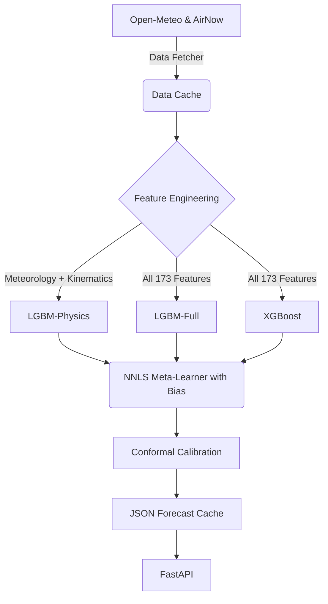

# Folsom AQI Navigator Backend

[](https://www.python.org/downloads/)
[](https://opensource.org/licenses/MIT)
[](https://github.com/astral-sh/ruff)
[](https://fastapi.tiangolo.com)

A robust, physics-informed machine learning backend for predicting PM2.5 Air Quality Index (AQI) in Folsom, California. This repository serves as the computational engine for the Folsom AQI Navigator dashboard and the accompanying academic research paper.

## 🔬 Scientific Overview

This system utilizes a Feature-Diversity Stacked Ensemble to forecast PM2.5 levels at 6h, 12h, 24h, and 48h horizons. 
Unlike traditional naive time-series models, this architecture is rigorously grounded in atmospheric physics, leveraging:
- **Lagrangian Back-Trajectories:** Kinematic wind transport to determine air parcel origins.
- **Atmospheric Stability Indices:** Quantitative measurement of boundary layer height (BLH), ventilation deficits, and inversion strengths.
- **Season-Aware Conformal Prediction:** Mathematically guarantees $\ge 95\%$ coverage across all atmospheric regimes (Summer vs. Winter).

### Architecture



## 🚀 Quick Start

### Prerequisites
- Python 3.10+
- `make` (optional, but recommended)

### Setup

1. **Clone the repository:**
   ```bash
   git clone https://github.com/arsanisl-code/folsom-aqi-backend.git
   cd folsom-aqi-backend
   ```

2. **Set up the environment:**
   Create a virtual environment and install dependencies.
   ```bash
   make install
   ```

3. **Configure API Keys:**
   Copy the example environment file and add your keys.
   ```bash
   cp .env.example .env
   ```

4. **Run the API locally:**
   ```bash
   make run
   ```
   The API will be available at `http://localhost:8000`.

## 🛠 Model Training

To retrain the ensemble from scratch (requires a robust CPU):
```bash
make train
```

To run calibration for the conformal prediction intervals:
```bash
make calibrate
```

## 🐳 Docker Deployment

To build and run the backend inside an isolated container:
```bash
make docker-build
make docker-run
```

## 📚 Citation

If you use this code or model architecture in your academic research, please cite our paper:

```bibtex
@article{folsomaqi2026,
  title={Physics-Informed Ensemble Forecasting for Micro-Regional Air Quality},
  author={Your Name},
  journal={TBD},
  year={2026}
}
```
*(Please see `CITATION.cff` for more citation formats).*

## 📄 License

This project is licensed under the MIT License - see the `LICENSE` file for details.
